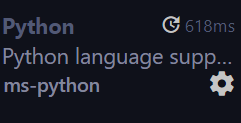

# 飞虹编程无人机的python开发接口
## 如何使用?
* 安装依赖包
```bash
pip install -r requirements.txt
```
* 使用示例
```python
// 在根录下创建py文件
from fhfly.helloFly import fly

fh = fly()

```
## 如何运行代码?
### Cmd/Powershell/Gitbash 等命令行工具
```bash
python XXX.py
```
### Vscode
1. 打开Vscode扩展商店

2. 安装Python扩展

3. 点击Vscode右上角的运行代码

